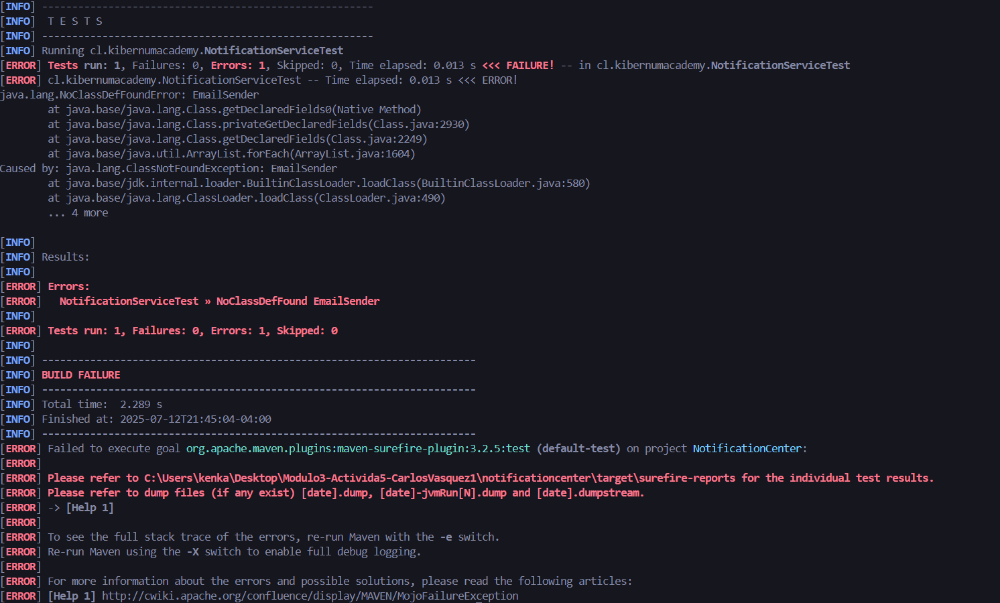
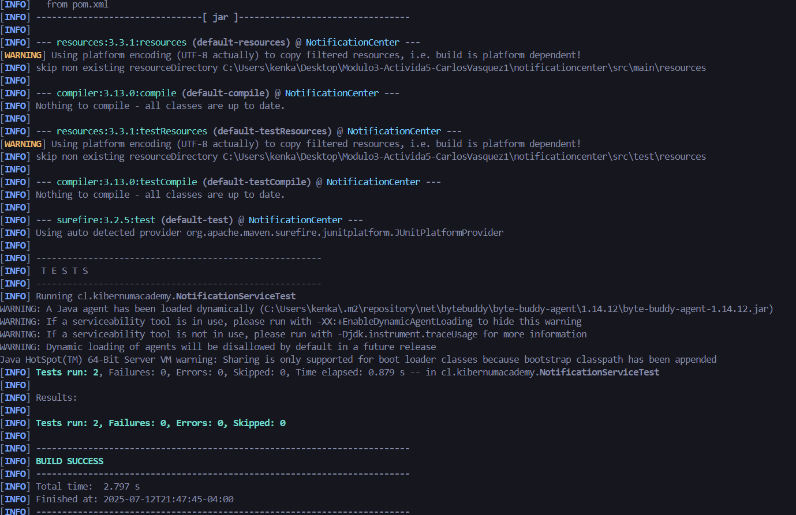
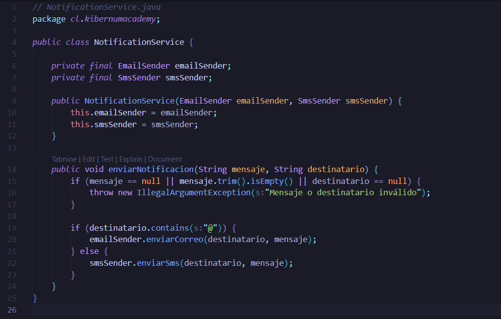
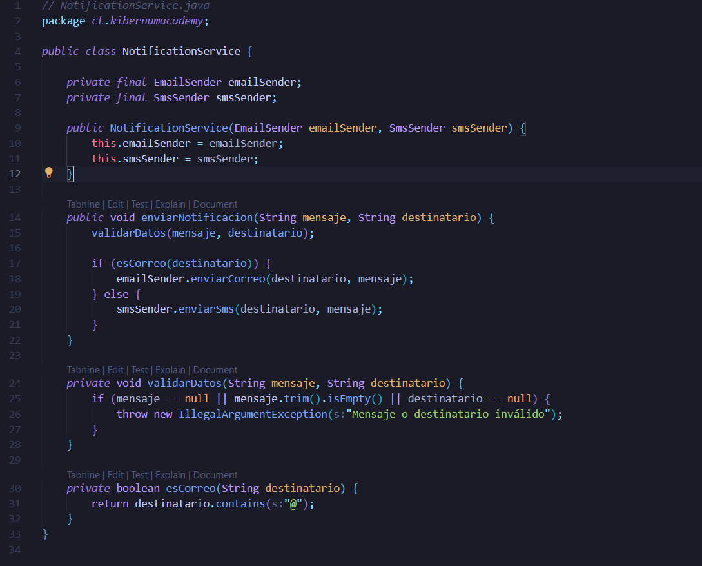

# 📨 NotificationCenter
Un sistema de envío de notificaciones multicanal que aplica el enfoque TDD (Test-Driven Development) con uso de JUnit 5 y Mockito.

---
👨‍💻 Autor
Módulo 3 -  Actividad 5

- Carlos Vásquez


## 🔁 Ciclo TDD: Red - Green - Refactor

TDD se basa en tres pasos fundamentales:

### 🔴 Red: Se crean pruebas que fallan para validar condiciones como mensaje vacío o destinatario nulo.



### ✅ Green: Se implementa la lógica mínima para que las pruebas pasen correctamente.



### ✅ Green: Código Zona Verde



### ♻️ Refactor: Mejorar el código sin romper las pruebas


### ♻️ Refactor Código: Se mejora el diseño del código extrayendo funciones y haciendo el código más limpio.

  

---

## 🚀 Objetivos

- La lógica de envío de notificaciones.
- El uso de canales (Email o SMS).
- Validaciones de datos.
- Registro de historial.
- Interacciones mediante mocks.

✅ Pruebas incluidas
- Verifica que no se envíe si el mensaje es vacío o el destinatario es nulo.
- Verifica que se use emailSender si el destinatario contiene @.
- Verifica que se use smsSender si el destinatario es un número.
- Usa @Mock, @InjectMocks, @ExtendWith(MockitoExtension.class) y verify() de Mockito.
---
## 📁 Estructura del proyecto

NotificationCenter/
├── src/
│   ├── main/
│   │   └── java/cl/kibernumacademy/
│   │       ├── NotificationService.java
│   │       ├── EmailSender.java (interface)
│   │       ├── SmsSender.java (interface)
│   │       ├── EmailSenderImpl.java
│   │       └── SmsSenderImpl.java
│   └── test/
│       └── java/cl/kibernumacademy/
│           └── NotificationServiceTest.java
├── pom.xml
└── README.md

## 🧪 Tecnologías utilizadas

- Java 17+
- JUnit 5
- Mockito (mockito-junit-jupiter)
- Maven (gestión de dependencias y build)

---

## ▶️ Cómo ejecutar

1. Clona el repositorio:

```bash
git clone  https://github.com/kenkairon/Modulo3-Activida5-Carlos-Vasquez.git